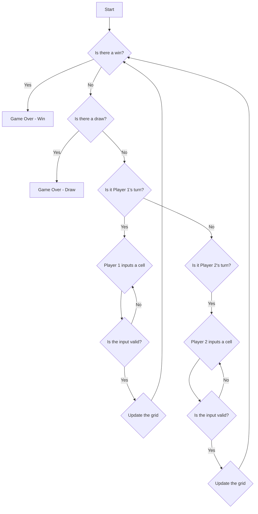

# Tic Tac Toe (Game Working)

#### The game is a simple 2 player game, where each player takes turns to put their symbol in an empty cell in a 2D grid. The player who makes a continuous stream of their symbol of size(N) in any way possible wins the game.

## Setup :

- A 2D grid of size (N * N) where each cell has default value (or is empty).

- Two players, who take turns choosing an empty cell to put a symbol representing them

## Conditions / States :

- **Win:** When a player makes a continuous stream of their symbol of size(N) in any way possible along, across or diagonally. Game is Over after a win.

- **Lose:** When a player has won the game, and it is over, the other player has lost the game.

- **Draw:** When all the cells are filled and no player has won the game, it is a draw. Game is Over after a draw.

- **Ongoing:** When the game is still in progress and no player has won or lost or drawn.

## Flowchart:

