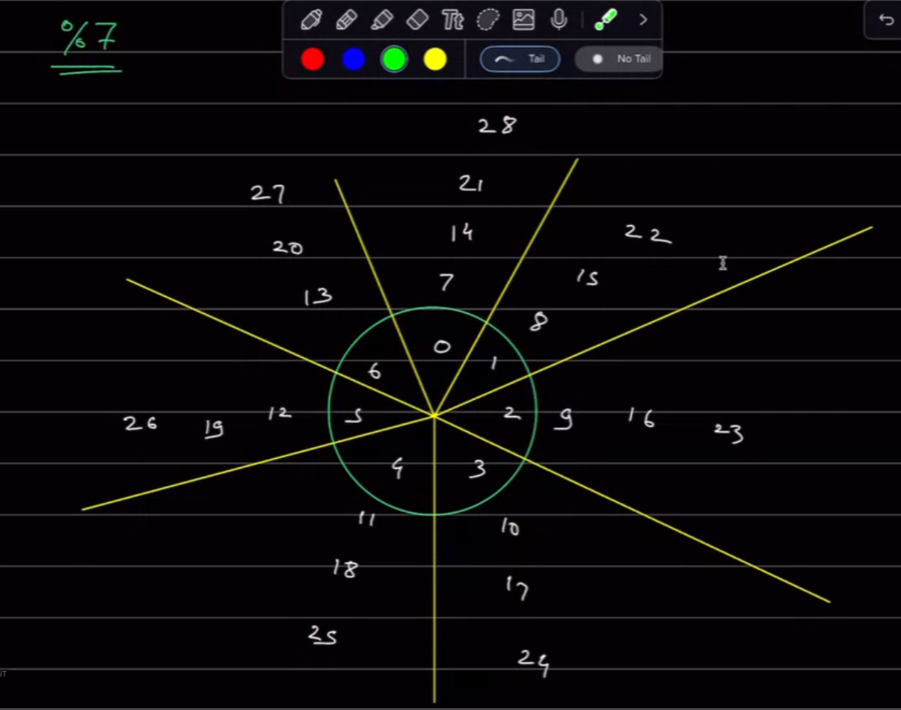

# Modular Arithmetic (Magic)

## 1. Basic Maths

* ### Modulo Operator `%`
    * `a % b` is the remainder when `a` is divided by `b`
        * 7 % 3 = 1
        * 7 % 4 = 3
        * -30 % 7 = 5
        * 30 % -7 = -2

    * `a % b` is always lies in the range `[0, b-1]`

    * This means that we are essentially limiting any large ramge of numbers to a smaller range.

* ### Mod 7 clock
    * The mod 7 clock shows all the numbers from 0 to 6 and then repeats.

    * All the numbers are in the range `[0, 6]` make upa a section an the next numeber of the section is 7 more than the previous.

    * 

## 2. Interview Perspective

* ### Formulas:
    * `(A + B) % M  = (A % M + B % M) % M`

    *  `(A - B) % M  = (A % M - B % M + M) % M`

    * `(A * B) % M  = (A % M * B % M) % M`

    * `(A / B) % M  = (A % M * B^(-1) % M) % M`
        * Where `B^(-1)` is the modular multiplicative inverse of `B` modulo `M`

## 3. Questions
    1. 

    2. Given an array representing a large Prime No, return (P^2 - 1) % 24. (|A| <= 10^5)

    Sol: (P^2 - 1^2) % 24 -> (P - 1) * (P + 1) % 24 -> Always 0.

    3. (Amazon) Given two No. N & M (N > M), Find the count of numbers (A > 0) such that N % A = M % A
    